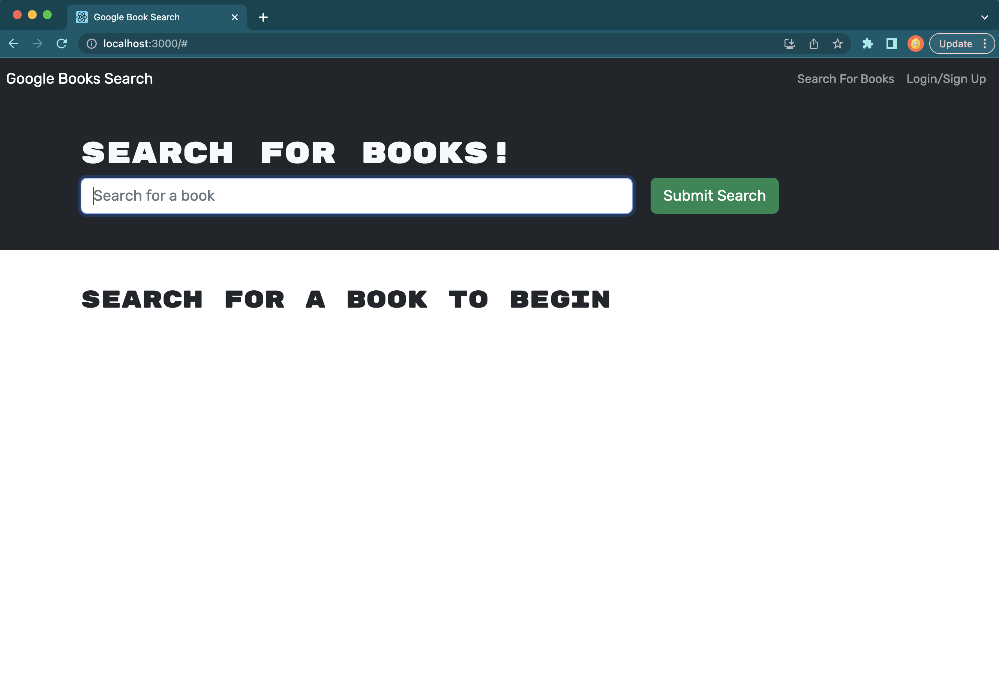
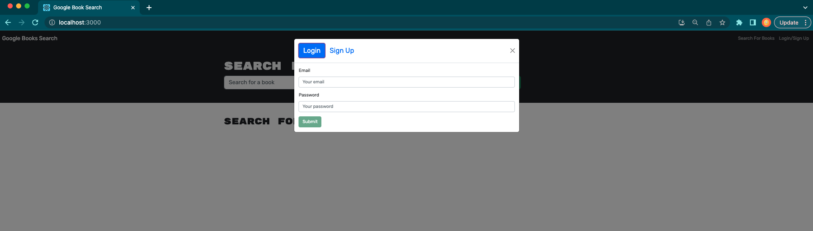
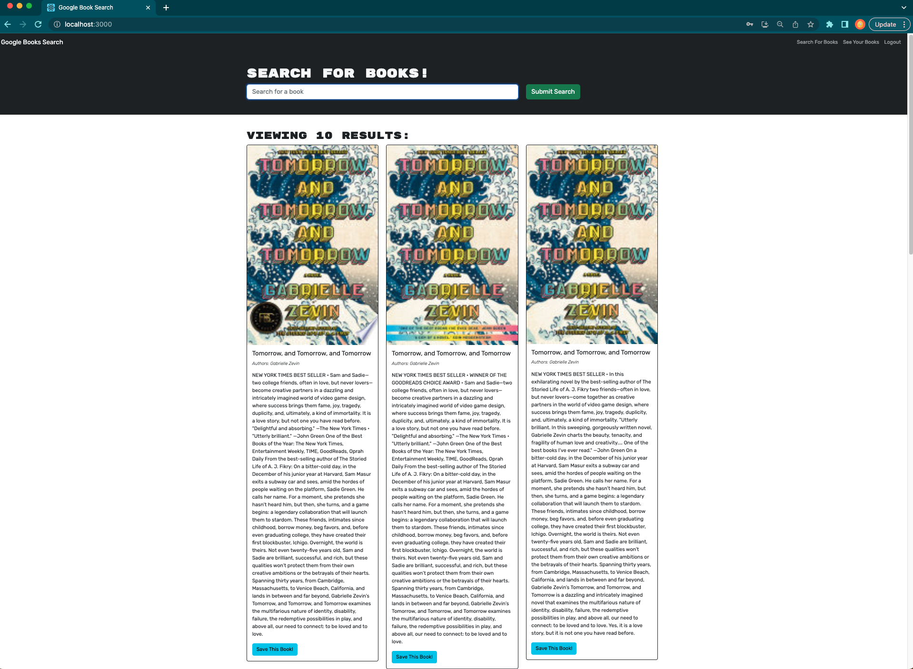
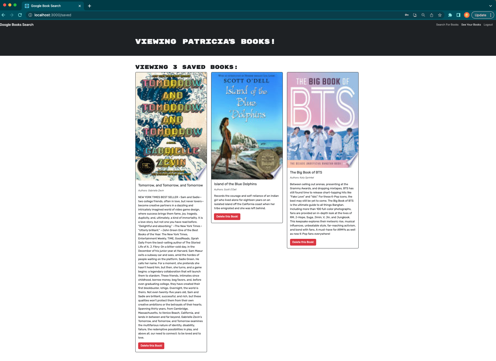

# MERN-Book-Searching-Engine-21

## Description

The motivation for this project was to take an API search engine built with a RESTful API and refractor into a GraphQL API built with Apollo Server.  With this app, users are able to save book searches in the back end.  The app was built using the MERN stack, with a React front end, MongoDB, and Node.js/Express.js server and API.  

The MERN Book Search Engine takes on the user story: 
AS AN avid reader
I WANT to search for new books to read
SO THAT I can keep a list of books to purchase.  

By building this project, I applied the knowledge learned on GraphQL queries and mutations and integrated them with an Apollo server to enable their utilization by the user in the front end.  

## Installation

Steps to install this project:

- Run 'npm i' in the root project directory to install all packages and dependencies.  

- Run 'npm run develop' to concurrently run the server and client applications as the server runs on port 3001 and client runs on port 3000. 

Required modules & dependencies:
- apollo-server-express^3.11.1
- express^4.17.2
- graphql^15.8.0

## Usage

LINK TO DEPLOYED APPLICATION: https://git.heroku.com/whispering-eyrie-44486.git

Once 'npm run develop' the book search engine will spin up in the browser. There, a menu is presented with an option to search for books by inputting a title and hitting the submit button, as well as a Login/Signup option. 

When the user searches for a book, the results appear with a button to save the book if they are logged in to their account.

Once logged in, the user can also view their saved books in their account, with the option to delete them as well.  -

## Credits

I would like to pay credit to our instructor Bryan Swarthout for walking us through the project and deployment.  

## License

Please refer to license in repo.  

## Questions

If you have any questions, please feel free to contact me at pkfalberto@gmail.com. 